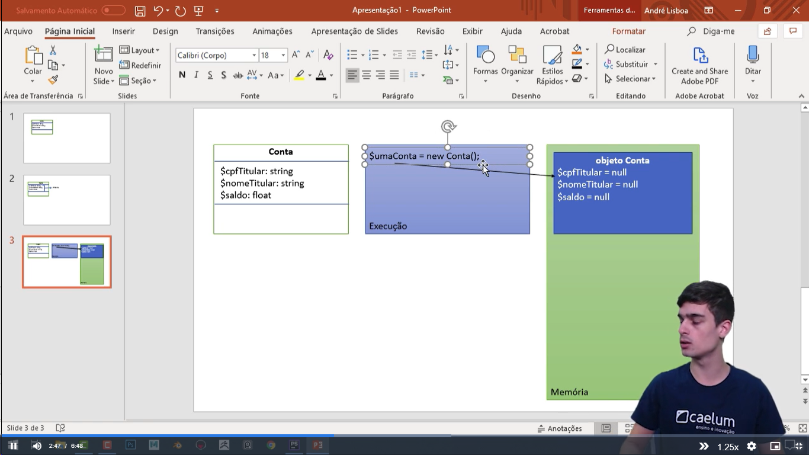

### Conceitos de POO

### Classe: 
Uma classe é um modelo ou um plano para criar objetos. Ela define os atributos (variáveis de instância) e os métodos (funções) que os objetos pertencentes a essa classe terão. As classes servem como modelos para a criação de objetos.

#### Objeto:
 Um objeto é uma instância concreta de uma classe. Ele representa uma entidade do mundo real que possui atributos (dados) e métodos (comportamentos) associados a ele. Os objetos são criados a partir de classes e são usados para interagir com o sistema.

#### Encapsulamento:
 O encapsulamento é o conceito de agrupar os atributos e métodos relacionados em uma única unidade chamada classe. Ele também envolve a restrição do acesso aos atributos e métodos de uma classe, permitindo que somente métodos específicos (métodos de acesso) acessem e modifiquem os atributos internos. Isso ajuda a proteger os dados e controlar o comportamento dos objetos.

####  Herança:
 A herança é um mecanismo que permite que uma classe herde atributos e métodos de outra classe (superclasse ou classe pai). Isso promove a reutilização de código, pois uma nova classe pode estender e especializar uma classe existente, aproveitando seus recursos.

#### Polimorfismo:
 O polimorfismo é a capacidade de objetos de classes diferentes responderem de maneira única a mensagens ou chamadas de métodos semelhantes. Isso permite que diferentes objetos se comportem de maneira diferente, mesmo quando estão respondendo à mesma mensagem.

#### Abstração:
 A abstração é a simplificação de objetos do mundo real em modelos e representações no código. Ela envolve a identificação e enfatização dos aspectos mais relevantes de um objeto enquanto oculta os detalhes irrelevantes ou complexos. A abstração ajuda a lidar com a complexidade e a criar interfaces mais intuitivas.

#### Método:
 Um método é uma função definida em uma classe que descreve o comportamento dos objetos dessa classe. Os métodos podem ser chamados para realizar ações ou retornar informações sobre um objeto.

#### Atributo: 
Um atributo é uma variável definida em uma classe que armazena dados específicos para cada objeto daquela classe. Os atributos representam as características do objeto.

#### Instância:
 Uma instância é um objeto criado a partir de uma classe. Cada instância possui seu próprio conjunto de atributos, mas compartilha os métodos definidos na classe.

#### Construtor:
 Um construtor é um método especial em uma classe usado para criar e inicializar objetos da classe. É chamado automaticamente quando um objeto é instanciado.

Esses conceitos formam a base da programação orientada a objetos e são usados para modelar e organizar sistemas de software de forma mais modular, reutilizável e eficiente, facilitando a manutenção e a escalabilidade do código.

